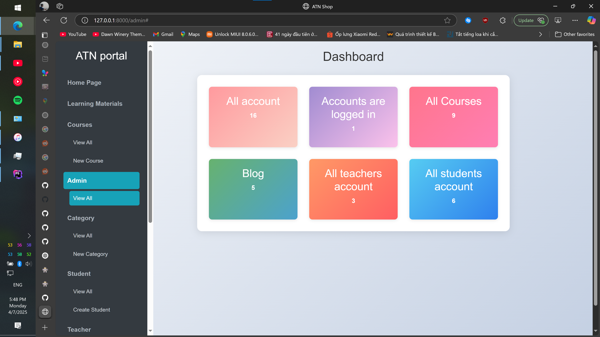
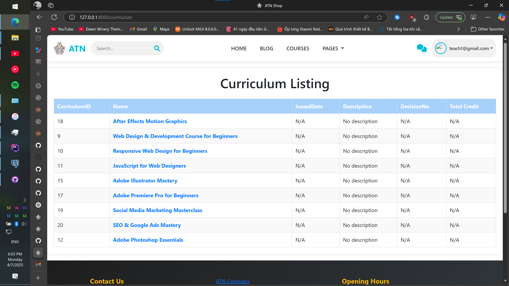
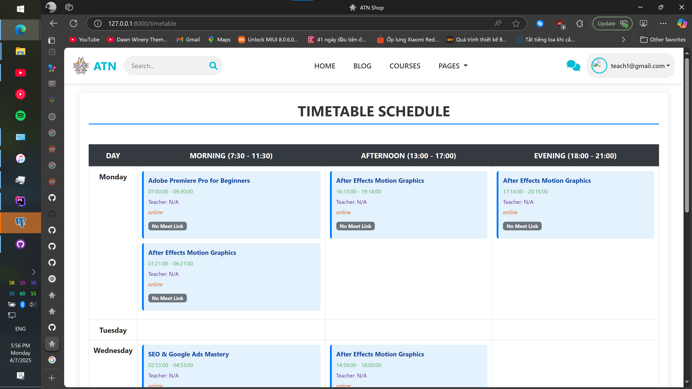
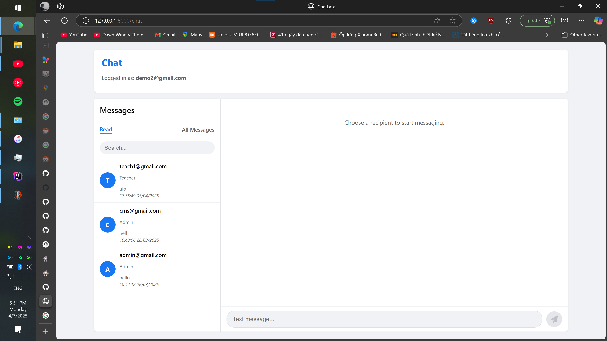
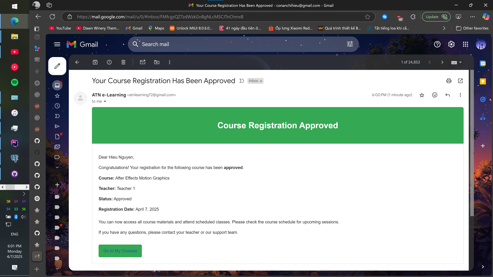

Here’s your full, updated and professional `README.md` — now with the **Screenshots** section included and everything integrated seamlessly:

---

```markdown
# 📘 E-Learning Platform

A robust e-learning platform built with Laravel, designed to support digital education workflows for students, teachers, and staff. The system provides core functionalities such as course management, learning materials, timetabling, real-time chat, messaging, and more — making it suitable for schools, colleges, and training institutions.

## 🚀 Features

### 🧑‍🏫 Teacher Features
- Upload learning materials for courses
- View teaching timetable
- Communicate with students and staff via real-time chat and internal messaging

### 🧑‍🎓 Student Features
- View and download approved learning materials
- Access personalized timetable
- Smart search for materials and messages
- Receive real-time message notifications
- Register for courses (manual process)

### 🧑‍💼 Staff/Admin Features
- Review and approve/reject uploaded materials
- Manage class and teacher timetables
- Oversee course registrations
- Monitor activity and analytics
- Manage user roles and permissions

### 💬 Communication & Notifications
- **Real-time chat** between users (WebSocket or polling-based)
- Internal messaging system with notifications
- PostgreSQL-backed alert system for new messages and events

## 🛠 Tech Stack

- **Framework**: Laravel 10+
- **Database**: PostgreSQL
- **Frontend**: Blade / Tailwind CSS / (optional: Vue.js or React)
- **Authentication**: Laravel Breeze / Jetstream / Sanctum
- **File Handling**: Laravel Filesystem (local or cloud storage)
- **Real-time**: Laravel Echo / Pusher / WebSockets
- **Version Control**: Git + GitHub

## 📁 Project Structure (Simplified)

```
app/
├── Http/
│   ├── Controllers/
│   │   ├── LearningMaterialController.php
│   │   ├── TimetableController.php
│   │   ├── CourseController.php
│   │   ├── ChatController.php
│   │   └── ...
├── Models/
│   ├── User.php
│   ├── Teacher.php
│   ├── Student.php
│   ├── Message.php
│   ├── CourseRegistration.php
│   └── ...
resources/
├── views/
routes/
├── web.php
public/
├── uploads/
```

## ⚙️ Setup Instructions

1. **Clone the repository**

```bash
git clone https://github.com/your-username/elearning-platform.git
cd elearning-platform
```

2. **Install PHP and JavaScript dependencies**

```bash
composer install
npm install && npm run dev
```

3. **Set up environment**

```bash
cp .env.example .env
php artisan key:generate
```

4. **Configure `.env`**

Update your environment variables for DB connection, mail, chat, and storage.

5. **Run migrations (optional)**  
> _Skip if you're managing the database schema manually_

```bash
php artisan migrate
```

6. **Serve the application**

```bash
php artisan serve
```

## 🔐 Roles and Permissions

| Role    | Capabilities |
|---------|--------------|
| **Student** | Download materials, view timetable, search, messaging/chat |
| **Teacher** | Upload materials, view schedule, messaging/chat |
| **Staff**   | Approve materials, manage timetable, manage users |
| **Admin**   | Full system access, user management, analytics |

## 📊 Feature Status

- ✅ Smart search for learning materials and messages  
- ✅ Dashboard widgets for activity overview  
- ✅ Real-time chat  
- ⏳ Course grading system  
- ⏳ Quiz and test functionality  
- ⏳ Analytics for student progress and course engagement  

## 📸 Screenshots

### 🏠 Dashboard


### 📚 Learning Materials Page


### 🕒 Timetable View


### 💬 Real-Time Chat


### 🔔 Notifications


## 🧾 License

This project is licensed under the [MIT License](LICENSE).

---

> Made with ❤️ using Laravel
```

Once you have your screenshots ready, save them in a `screenshots/` folder in the root of your repo and you're good to go.

Want help generating those screenshots, making badges, or designing a logo next?
